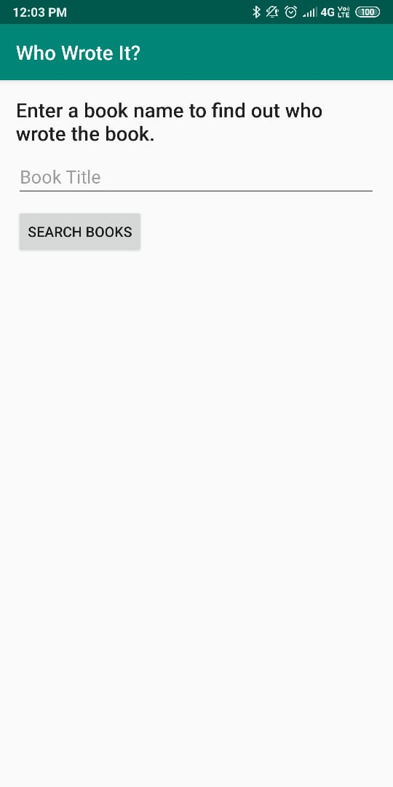
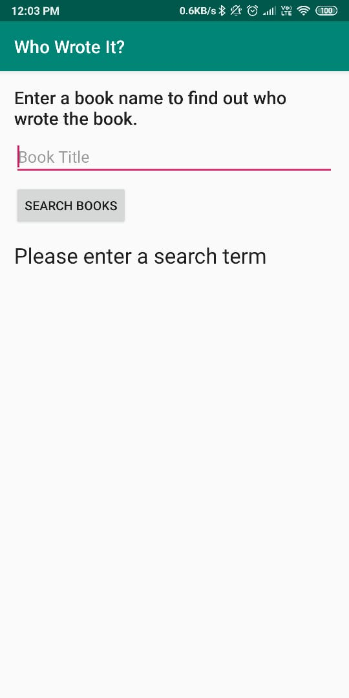
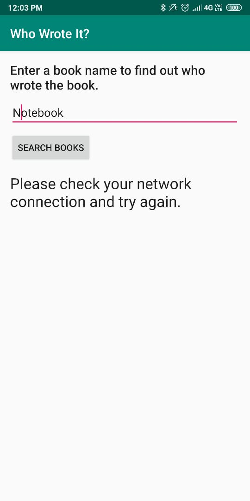
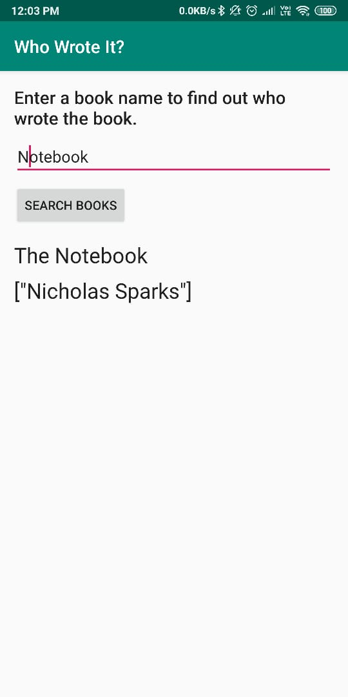

# Who Wrote It
This app covers concepts of AsyncTask and AsyncTask loader.

This app uses Googles Books API to search for a book and display the first results author and book title. Also we covered how to check for an internet connection, check for text inside edittext, keyboard visiblity.
  
       

      

