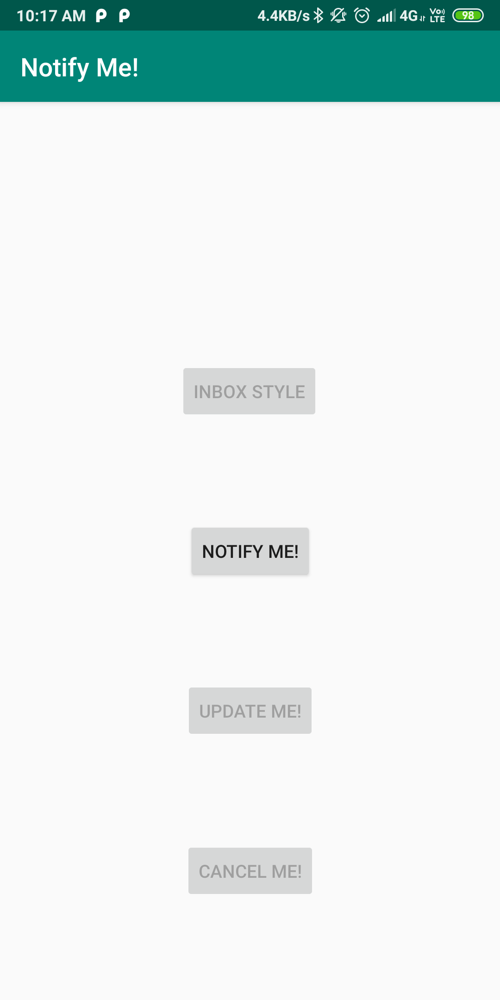
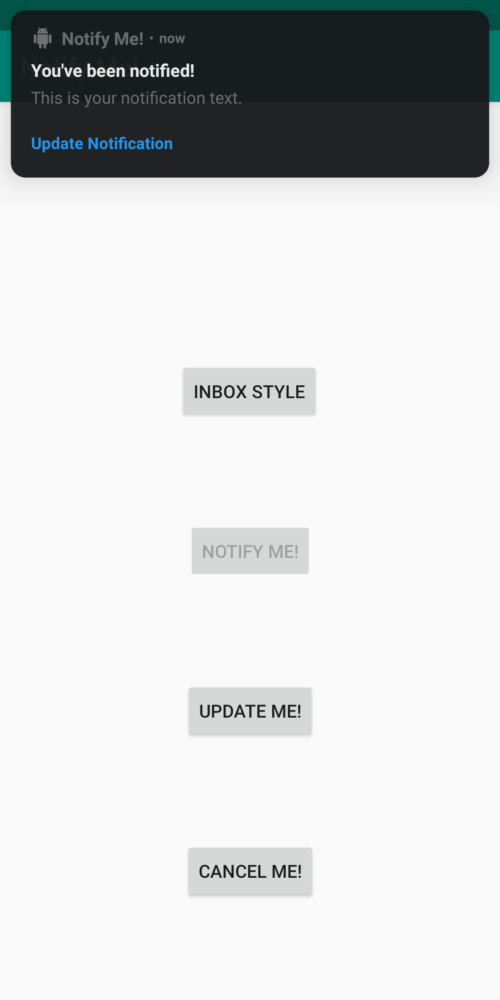
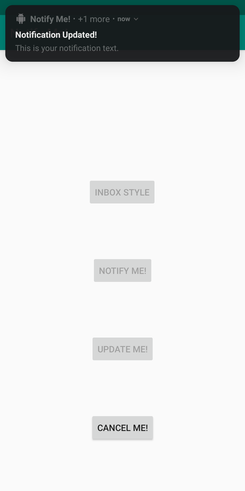

# NotifyMe

This application basically covers notifications concepts. 
- How to create a notification
- How to create a notification channel
- update and cancle a notification using broadcast receivers.
- Try out inbox styled notification.

       

       

