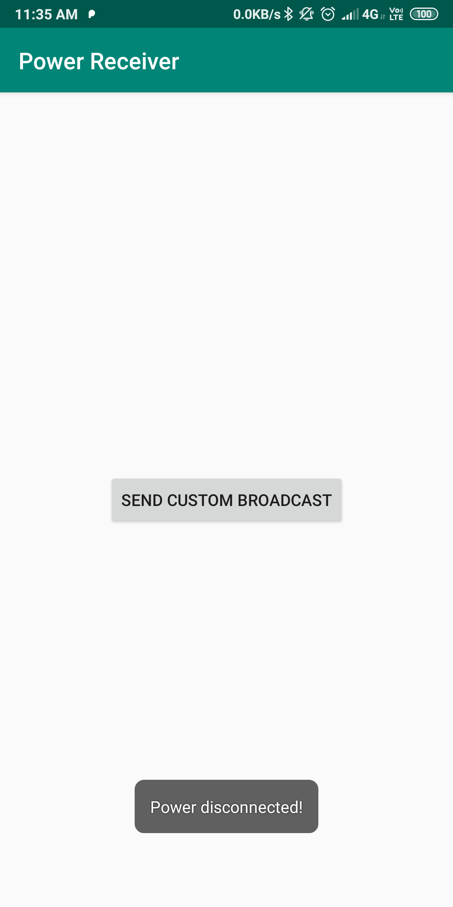
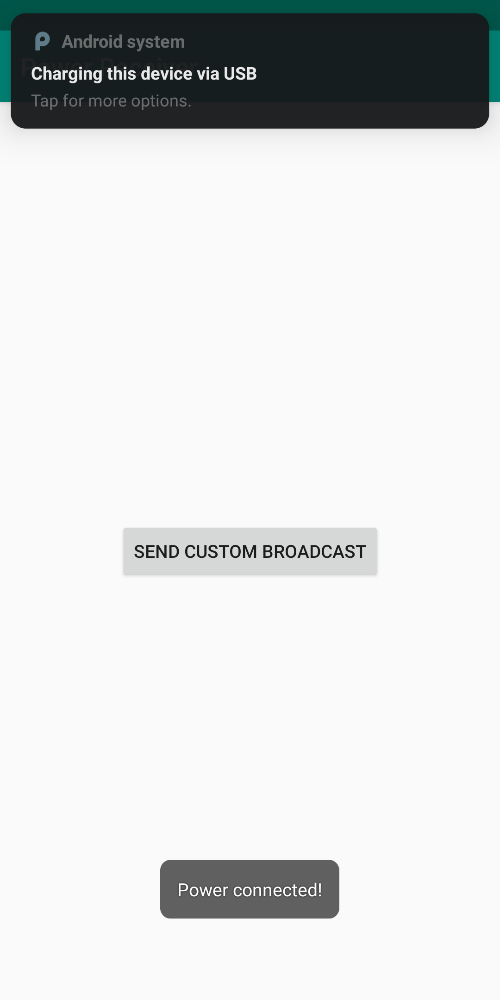
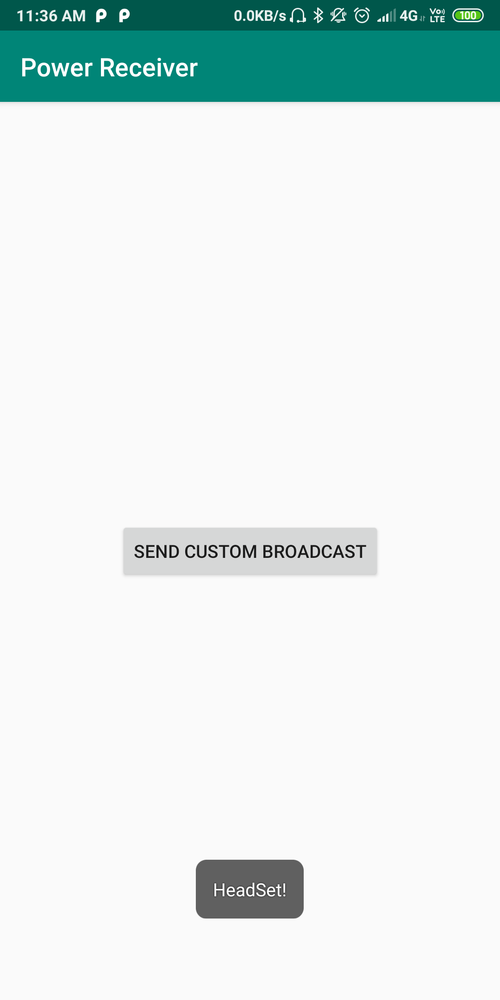
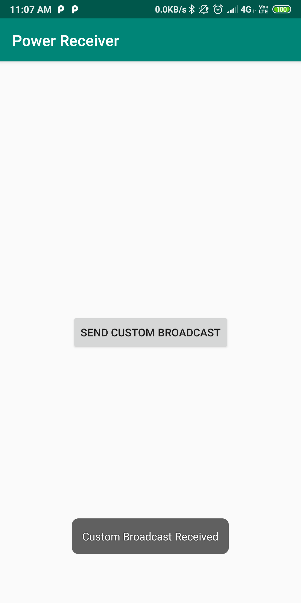

# Power Receiver

This project deals with broadcast receivers. In this project we create dynamic receiver to detect power changes and show a toast
- We covered how to register and unregister dynamic recievers
- Send custom broadcast using LocalBroadcast.

     

       
