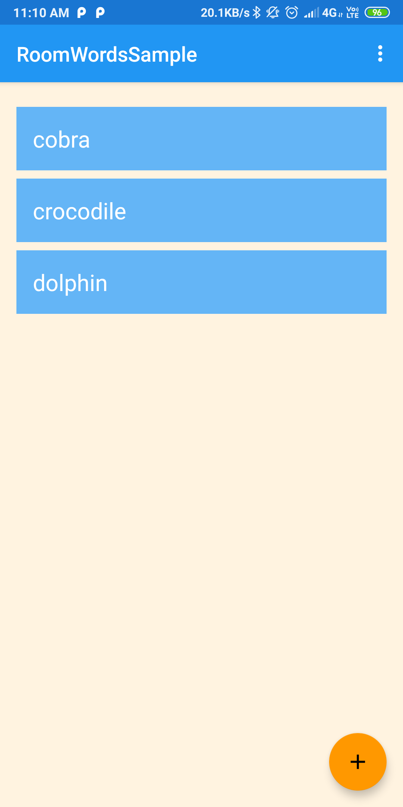
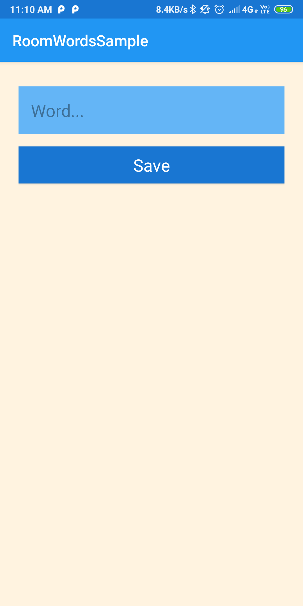
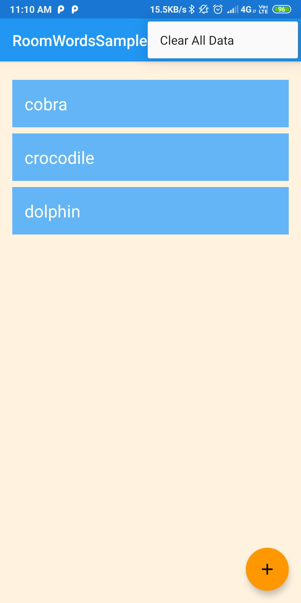
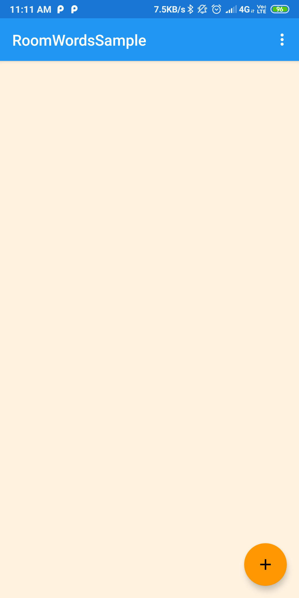

# RoomWordsSample

This app covers concepts of Room Database
- It has covered ViewModel
- It has covered LiveData
- It has covered Room with Repository structure.

This app initially loads up some data into the database if there is no data available. Then we can add new words to the database or we can swipe to delete existing words. We can edit existing words by tapping on them. We can also clear all the words from the database by clicking clear All data button in the menu.
  
       

      

